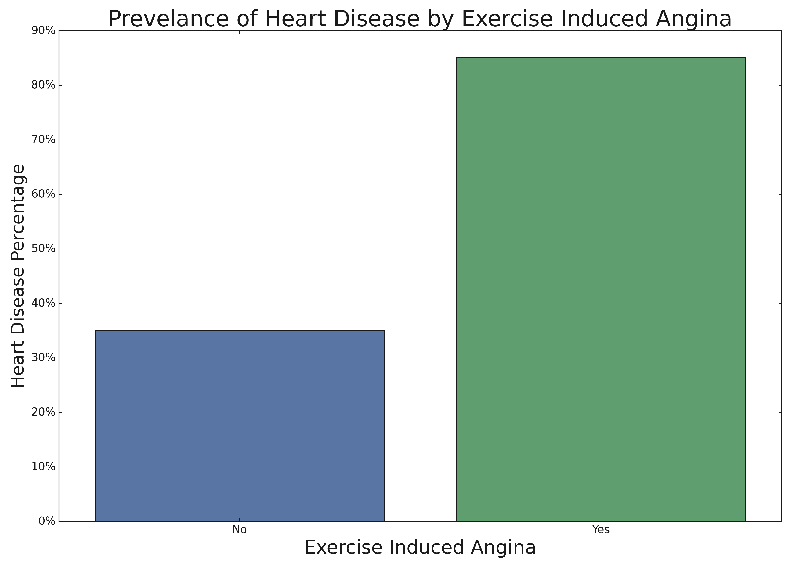
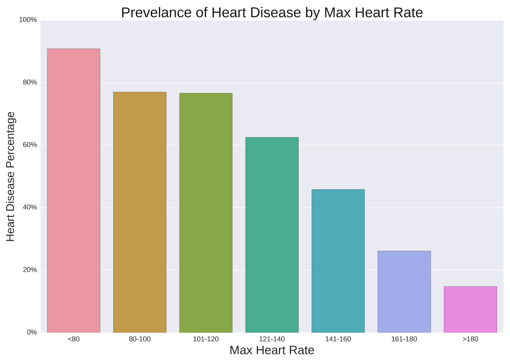

# Healthcare Predictions
## Making a difference for heart disease patients

**Author**: Justin Faber

### Objective:

What key metrics best predict heart disease? By knowing only a few key things about patients, can we predict their future health? Time to find out! 

### Data:
We have, in total, just under 1,000 patients and their health information. Some of our key metrics include the patient's age, sex, cholesterol, their resting blood pressure and their max heartrate. In total we have 11 key metrics per patient, to help us evaluate the all important 12th variable: do they have heart disease?

## Methods
- To prepare our data for this project we did the following:
  - Removed any duplicate rows from within our dataset
  - Explored any missing values from within our data
    -  While we noticed that there weren't any actual "missing values" in our data, we did find an occurance of "0" for one patient for their resting blood-pressure. This certainly isn't possible, so we treated this value the same as "missing", and with only a single row being affected we just dropped that one row. 
  -  We looked for any potential outliers from within our dataset, but found nothing so far outside of the norm that warranted removal, so we left all remaining data in the dataset for further exploration!

## Results
Our first goal was to better understand our data, and look for strong correlations between any of the features and our target. After a deep dive into all of the different featues, we came out with two major takeaways and two major correlations. Each expressed and explained in the following visualizations:

#### Heart Disease Prevelance By Exercise Induced Angina

> What we learned initially from our data is that there is a strong correlation between what initially caused the angina (heart pains) and whether or not the patient had heart disease. As you can see from the above visualization, if the patient presented WITH exercise induced angina, the prevelance of heart disease was approaching 85%! Wow!! 

#### Heart Disease Prevelance By Max Heart Rate

> The next extremely strong correlation that we found was when we investigated max heartrate, and it's relationship with heart disease. What we found was pretty profound! Across our ENTIRE dataset, as max heart rate decreased, heart disease prevelance increased! As you can see in our visualization, patient's with a max heartrate over >180 beats per minute, or the highest category in our dataset, saw a heart disease prevelance of under 20%. On the flip side of that, our patient's with the lowest max heartrate (anything below 80) were on the opposite end of the spectrum and saw a heart disease prevelance of nearly 90%!! 

## Model

After exploring and testing multiple models, our highest performing model for our data was a KNN model. We tested multiple different models, including gradient boosting and PCA, but in the end our base KNN model (with some slight hyper-parameter tuning) was the winner. 

This final model had an overall accuracy of just under 90% 

We also made it a point to try to minimize the number of false negatives that our model would generate, as we all understand the importance of identifying those with the disease so they can seek treatment.   

## Recommendations:

With a model accuracy of just under 90%, and a limited number of false negatives, my recommendation is to move forward with implementation of the model to help us try to identify and seek treatement for potential patients with heart disease. I'm confident in the model's ability to be a "first line of defense" in detecting heart disease, and hopefully save a few lives in the process! 

### For further information

For any additional questions, please contact **JFaberSFSD@gmail.com**
